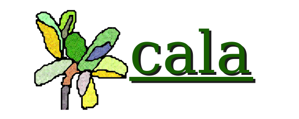

<p align="center">
  
</p>
<p align="center">
<a href="https://docs.rs/cala"></a>
<a href="https://travis-ci.com/Aldarobot/cala"></a>
<a href="https://crates.io/crates/cala"></a>
<a href="https://discord.gg/nXwF59K"></a>
	  <br>
  <strong><a href="https://aldarobot.plopgrizzly.com/cala/">Website</a> | <a href="https://github.com/Aldarobot/cala">GitHub</a> | <a href="https://aldarobot.plopgrizzly.com/cala/changelog">Changelog</a> | <a href="https://aldarobot.plopgrizzly.com/cala/tutorials">Tutorials</a> </strong>
</p>

<p>
<h4>Note</h4>
<p>Cala is a complete redesign of previous library <a href="https://crates.io/crates/adi">ADI</a>.  It is still in it's early stages.
</p>
</p>
<h1>About</h1>
<p>Easily create cross-platform applications.  Some common tasks are not easily portable across different platforms, and this crate hopes to fix that.  That way you don't have to worry about how to port your GUI, audio, or bluetooth interface, etc. and can get straight to building your application's content!
</p>
<p>Cala is a platform-agnostic system interface for hardware IO.  This means that eventually, Cala should support all of the different hardware that's connected to your computer.  Cala is designed so that it talks to the operating system to interface with the hardware, so no special permissions are needed for your application.  Here's a list of all of the targeted platforms (<b>bold</b> means a port has been made, <i>italic</i> means the feature doesn't work on the platform):
<ul>
<li><b>Linux</b></li>
<li><b>MacOS</b> - missing <a href="https://github.com/Aldarobot/cala/issues/5"><i>audio</i></a>, <a href="https://github.com/Aldarobot/cala/issues/7"><i>controller</i></a>, <a href="https://github.com/Aldarobot/cala/issues/9"><i>graphics</i></a></li>
<li><b>Windows</b> - missing <a href="https://github.com/Aldarobot/cala/issues/4"><i>audio</i></a>, <a href="https://github.com/Aldarobot/cala/issues/6"><i>controller</i></a>, <a href="https://github.com/Aldarobot/cala/issues/8"><i>graphics</i></a></li>
<li>Redox</li>
<li>Android</li>
<li>iOS</li>
<li>Web (WASM)</li>
<li>Nintendo Switch</li>
<li>XBox</li>
<li>PlayStation</li>
<li>FreeBSD</li>
<li>Maybe FreeDOS for fun 😉️</li>
<li>Others not on this list that you will make a pull request for adding them</li>
</ul>
</p>

<h1>Motivation & Naming</h1>
<p>
The aim is to create a newer, better GTK + SDL in Rust!  Why GTK + SDL?  Because a lot of programs need to depend on both anyway (like <a href="https://en.wikipedia.org/wiki/Totem_Video_Player">totem</a>), and they do a lot of the same things; Usually one library does each specific task better than the other.  The goal of this library is to provide the common ground for video games and general GUI applications together.  The name cala is derived from the fungus known as calafate rust.

<h1>Getting Started</h1>
<p>Each hardware interface can be enabled with a feature.  For example, If you
want to depend on the <code>audio</code> feature and the <code>clock</code>
feature, you might put this in your <code>Cargo.toml</code>:</p>

```toml
[dependencies.cala]
version = "0.5"
features = ["audio", "clock"]
```

<p>
There is a module for each feature (feature and module names match).  Module documentation may include simple tutorials.  More in depth tutorials may be
found <a href="https://aldarobot.plopgrizzly.com/cala/tutorials">here</a>.
</p>

<h2>Features</h2>
<p>Here's a list of the features, with links to documentation.</p>

<ul>
<li><a href="https://docs.rs/cala/0.5.0/cala/user/index.html"><code>user</code></a> - Getting user information</li>
<li><a href="https://docs.rs/cala/0.5.0/cala/audio/index.html"><code>audio</code></a> - Playing / recording audio</li>
<li><a href="https://docs.rs/cala/0.5.0/cala/clock/index.html"><code>clock</code></a> - Date, Time of day, Timer</li>
<li><a href="https://docs.rs/cala/0.5.0/cala/controller/index.html"><code>controller</code></a> - Game Controller - JoyStick</li>
<li><a href="https://docs.rs/cala/0.5.0/cala/files/index.html"><code>files</code></a> - Containerized filesystem loading / saving ZIP files</li>
<li><a href="https://docs.rs/cala/0.5.0/cala/graphics/index.html"><code>graphics</code></a> - Render and User Interface</li>
<li>Camera - Webcam <a href="https://github.com/Aldarobot/cala/issues/1"><i>unimplemented</i></a></li>
<li>Network - Bluetooth & Wifi Direct <a href="https://github.com/Aldarobot/cala/issues/10"><i>unimplemented</i></a></li>
<li>Hardware acceleration - SIMD, GPU <a href="https://github.com/Aldarobot/cala/issues/11"><i>unimplemented</i></a></li>
</ul>

<h1>Contributing</h1>
<p>
Contributors are always welcome!  Whether it is a bug report, bug fix, feature request, feature implementation or whatever.  Don't be shy about getting involved.  I always make time to fix bugs, so usually a patched version of the library will be out soon after a report.  Features take me longer, though.  I'll also always listen to any design critiques you have.  If you have any questions you can email me at <a href="mailto:jeronlau@plopgrizzly.com">jeronlau@plopgrizzly.com</a>.  Otherwise, <a href="https://github.com/Aldarobot/cala/issues">here's a link to the issues on GitHub</a>.
</p>
<p>
And, as always, make sure to always follow the <a href="https://github.com/Aldarobot/cala/blob/master/CODEOFCONDUCT.md">code of conduct</a>.  Happy coding!
</p>

<h1>License</h1>
<p>
This repository is licensed under either of the following:
</p>
<ul>
<li>MIT License (MIT) - See accompanying file <a href="https://github.com/Aldarobot/cala/blob/master/LICENSE_MIT.txt">LICENSE_MIT.txt</a> or copy at <a href="https://opensource.org/licenses/MIT">https://opensource.org/licenses/MIT</a></li>
<li>Boost Software License (BSL-1.0) - See accompanying file <a href="https://github.com/Aldarobot/cala/blob/master/LICENSE_BSL.txt">LICENSE_BSL.txt</a> or copy at <a href="https://www.boost.org/LICENSE_1_0.txt">https://www.boost.org/LICENSE_1_0.txt</a></li>
</ul>
<p>
at your option.
</p>

<h2>Contribution Licensing</h2>
<p>
Unless you explicitly state otherwise, any contribution intentionally submitted for inclusion in the work by you shall be dual licensed as above without any additional terms or conditions.
</p>
